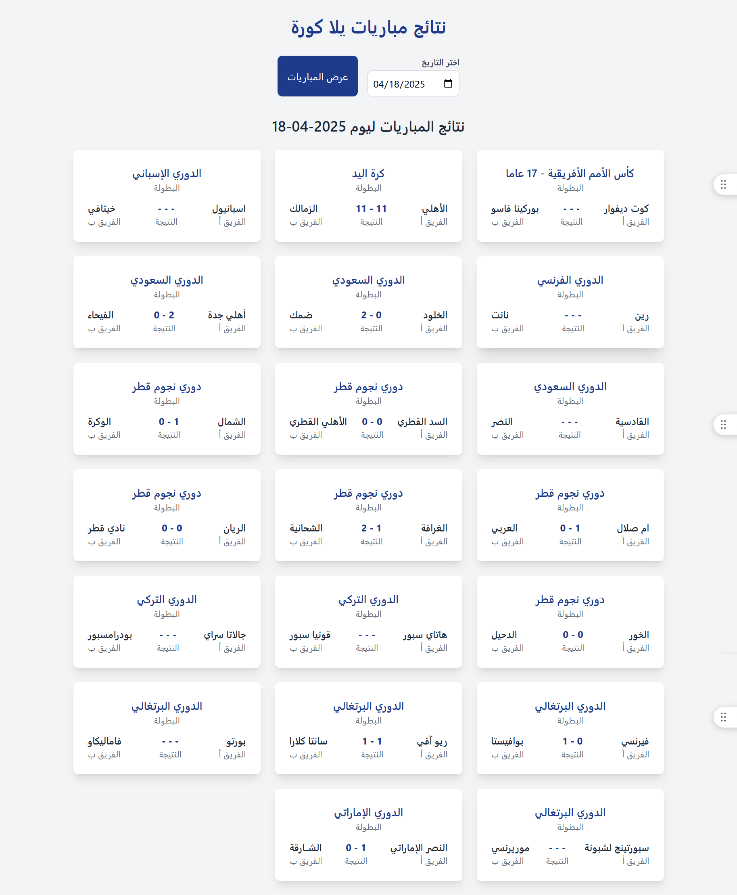

# Yallakora-Flask-show-Match

A simple web application to display football match results using Python (Flask) and modern web technologies.

[](https://yallakora-flask-show-match.vercel.app/)

**Live Demo:** [https://yallakora-flask-show-match.vercel.app/](https://yallakora-flask-show-match.vercel.app/)

## Overview

This project is a web application developed using Python (Flask framework) to fetch and display football match results from the Yalla Kora website. The user interface is designed to be attractive and user-friendly using Tailwind CSS.

**Key Features:**

- Fetches near real-time match data.
- Displays match results, team names, and championship name.
- Modern and responsive user interface using Tailwind CSS.
- Ability to view matches for a specific date (under development or can be added).

## Technologies Used

- **Python:** The primary programming language.
- **Flask:** A micro web framework for building web applications.
- **Requests:** A Python library for making HTTP requests to fetch web data.
- **Beautiful Soup 4:** A Python library for parsing HTML and XML documents.
- **Tailwind CSS:** A utility-first CSS framework for rapid UI development.
- **Pytz:** A Python library for timezone calculations (to determine Egypt's local time).
- **Vercel:** A cloud platform for deploying modern web applications easily.

## Running Locally

1.  **Install Python:** Make sure Python is installed on your system. You can download it from [https://www.python.org/downloads/](https://www.python.org/downloads/).
2.  **Clone the Repository:**
    ```bash
    git clone [https://github.com/gamalahmed3265/Yallakora-Flask-show-Match.git](https://github.com/gamalahmed3265/Yallakora-Flask-show-Match.git)
    cd Yallakora-Flask-show-Match
    ```
3.  **Create a Virtual Environment (Optional but Recommended):**
    ```bash
    python -m venv venv
    source venv/bin/activate  # On Linux/macOS
    venv\Scripts\activate  # On Windows
    ```
4.  **Install Dependencies:**
    ```bash
    pip install -r requirements.txt
    ```
5.  **Run the Application:**
    ```bash
    flask --app app.py run --debug
    ```
6.  Open your web browser and navigate to `http://127.0.0.1:5000/`.

# Yallakora-Flask-show-Match

تطبيق ويب بسيط يعرض نتائج مباريات كرة القدم باستخدام Python (Flask) وتقنيات الويب الحديثة.

[](https://yallakora-flask-show-match.vercel.app/)

**عرض مباشر:** [https://yallakora-flask-show-match.vercel.app/](https://yallakora-flask-show-match.vercel.app/)

## نظرة عامة

هذا المشروع هو تطبيق ويب تم تطويره باستخدام Python (مكتبة Flask) لجلب وعرض نتائج مباريات كرة القدم من موقع Yalla Kora. تم تصميم واجهة المستخدم بشكل جذاب وسهل الاستخدام باستخدام Tailwind CSS.

**الميزات الرئيسية:**

- جلب بيانات المباريات في الوقت الفعلي (تقريبًا).
- عرض نتائج المباريات، أسماء الفرق، واسم البطولة.
- واجهة مستخدم حديثة ومتجاوبة باستخدام Tailwind CSS.
- إمكانية عرض مباريات يوم محدد (قيد التطوير أو يمكن إضافتها).

## التقنيات المستخدمة

- **Python:** لغة البرمجة الأساسية.
- **Flask:** إطار عمل ويب صغير ومرن لتطوير تطبيقات الويب.
- **Requests:** مكتبة Python لإرسال طلبات HTTP لجلب بيانات الويب.
- **Beautiful Soup 4:** مكتبة Python لتحليل مستندات HTML و XML.
- **Tailwind CSS:** إطار عمل CSS يوفر أنماطًا جاهزة لتصميم واجهات مستخدم سريعة.
- **Pytz:** مكتبة Python للتعامل مع المناطق الزمنية (لتحديد التوقيت المحلي لمصر).
- **Vercel:** منصة نشر سحابية لتسهيل نشر تطبيقات الويب الحديثة.

## طريقة التشغيل محليًا

1.  **تثبيت Python:** تأكد من أن Python مثبت على جهازك. يمكنك تنزيله من [https://www.python.org/downloads/](https://www.python.org/downloads/).
2.  **استنساخ المستودع:**
    ```bash
    git clone [https://github.com/gamalahmed3265/Yallakora-Flask-show-Match.git](https://github.com/gamalahmed3265/Yallakora-Flask-show-Match.git)
    cd Yallakora-Flask-show-Match
    ```
3.  **إنشاء بيئة افتراضية (اختياري ولكن يُفضل):**
    ```bash
    python -m venv venv
    source venv/bin/activate  # على نظام Linux/macOS
    venv\Scripts\activate  # على نظام Windows
    ```
4.  **تثبيت المكتبات المطلوبة:**
    ```bash
    pip install -r requirements.txt
    ```
5.  **تشغيل التطبيق:**
    ```bash
    flask --app app.py run --debug
    ```
6.  افتح متصفحك وانتقل إلى `http://127.0.0.1:5000/`.

## ملاحظات

- هذا المشروع هو عمل شخصي وتعليمي لتطبيق مفاهيم الـ web scraping وتطوير الويب باستخدام Flask.
- قد يعتمد استخراج البيانات على هيكل موقع Yalla Kora، وقد يتطلب تحديثات إذا تم تغيير هيكل الموقع.
- يُرجى استخدام هذا التطبيق بشكل مسؤول وعدم إحداث أي ضرر لموقع Yalla Kora.

## للتواصل

- [صفحة التواصل](https://gamal-ahmed-portfolio.vercel.app/)
- [حساب GitHub](https://github.com/gamalahmed3265)

## شكرًا

## Demo


